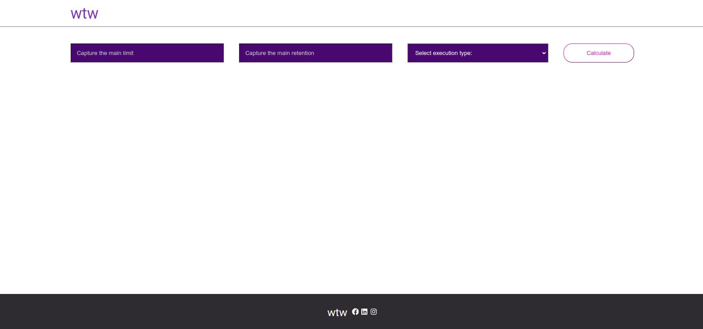
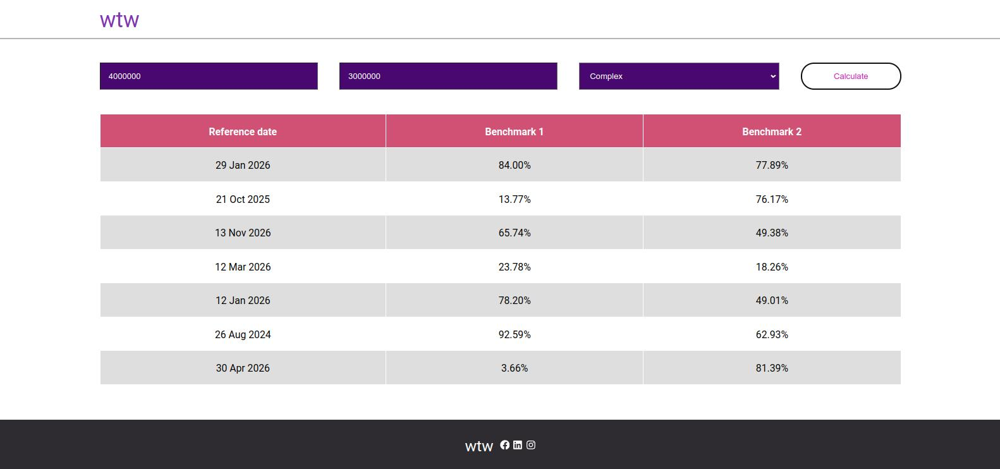

# Front end excersice

This projects implements a view for the user, where the user can trigger the calculation in an actuarial model.

## Instalation

To install project dependencies run the following command:

```bash
npm install
```

## Run the project

To start the project, run the following command:

```bash
npm start
```

Then, open [http://localhost:3000](http://localhost:3000) to view it in the browser.


## Screenshots




## Author
- [Daniel Montes Guerrero](https://github.com/DanielMontesGuerrero)
